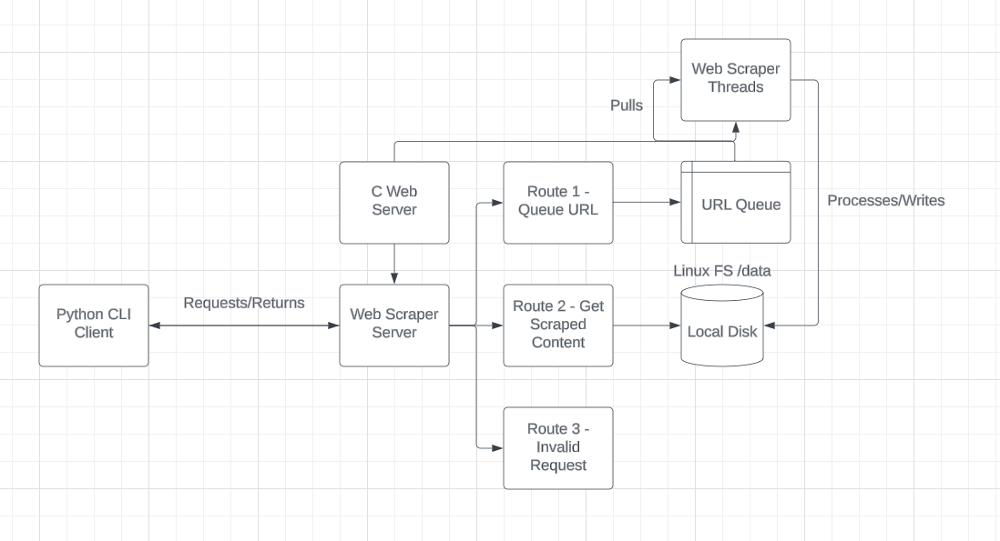

# Overview
This project consists of a C Web Server, a Python Client, and testing.
Each are documented in their respective docs md file in this folder.

The overall connection and layout is shown in the below diagram.

Before scraping any website please confirm with the websites terms of service that webscraping is explicitly allowed.

If I was going to use this outside of my 17D_19_1 JQR requirement I would license this under an appropriate open source license.

Justificatioon for Monolith for webb server
- Ease of initial development
- Not multiple teams/developers for splitting work
- Expected low number of qps